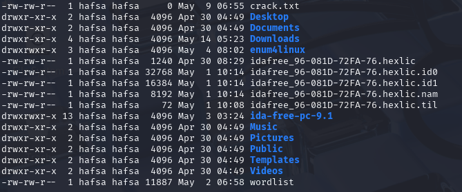

# 🐧 Linux Basics

## What is Linux?

Linux is an open-source operating system based on the Linux kernel. It's known for its flexibility, security, and widespread use in various applications — from servers and desktops to embedded systems and smartphones. It is especially popular among hackers and penetration testers.

If you are learning ethical hacking, it's essential to understand basic Linux terminal commands, as you will be interacting with it a lot.

## Common Linux Commands

| Command       | Description                          |
|---------------|--------------------------------------|
| `pwd`         | Show current directory               |
| `ls`          | List files and directories           |
| `cd folder`   | Change directory                     |
| `touch file`  | Create a new file                    |
| `mkdir name`  | Create a new directory               |
| `cat file`    | View the content of a file           |
| `rm file`     | Delete a file                        |
| `rm -d name`  | Delete a directory                   |
| `chmod +x`    | Make a file executable               |

## File Permissions

- `r` = read  
- `w` = write  
- `x` = execute

In the Linux file system, permissions are based on three categories:  
- the **file owner**  
- the **user group**  
- all **other users**

In the example above, the file `crack.txt` is readable and writable by the file owner and user group, but only readable by others.

