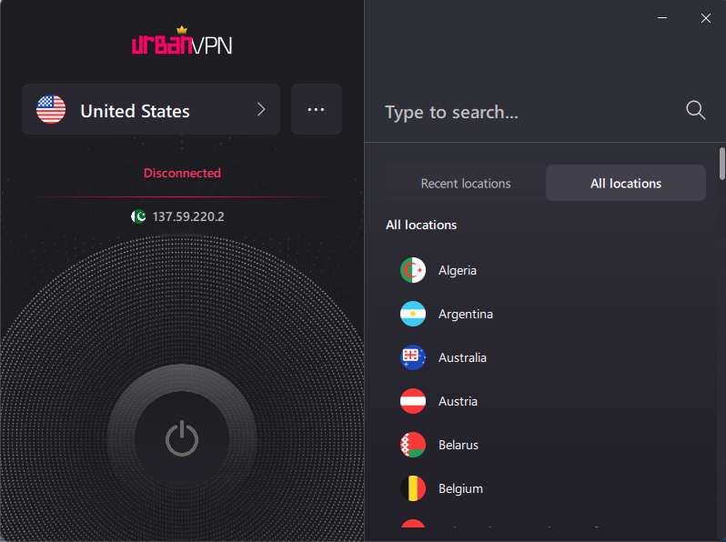

# 🌐 IP Addressing

---

An **IP address** (Internet Protocol address) is a unique number assigned to each device connected to a network. It helps identify who is sending or receiving data across the internet.

Think of it like a mailing address for your device — without it, your data wouldn't know where to go!

---

## 🏷️ Types of IP Addresses

There are two main types of IP versions:

### 🔹 IPv4
- Uses **32-bit** addresses.
- Written in dot-decimal format (e.g., `192.168.1.1`).
- Supports around 4.3 billion addresses.

### 🔹 IPv6
- Uses **128-bit** addresses.
- Written in hexadecimal format (e.g., `2001:0db8:85a3::8a2e:0370:7334`).
- Created because we are running out of IPv4 addresses.

---

## 🗣️ Public vs Private IP Addresses 🔒

### 🌍 Public IP Address
- Assigned by your **Internet Service Provider (ISP)**.
- Visible on the internet (used for browsing, communication, etc.).
- Example: `137.59.220.2`

### 🏠 Private IP Address
- Assigned by your **Wi-Fi router** or local network.
- Used only within your home or office network.
- Example: `192.168.1.16`

📌 Private IP ranges include:
- `192.168.0.0 – 192.168.255.255`
- `10.0.0.0 – 10.255.255.255`
- `172.16.0.0 – 172.31.255.255`

---

## 🛡️ VPN (Virtual Private Network)

A **VPN** hides your real public IP address by replacing it with one from a different location. This protects your privacy and can bypass geo-restrictions.

📸 Here's what happens when I use a VPN:

**Before VPN:**

**After VPN:**

---

## 🧠 Summary

- IP addresses help route traffic online.
- IPv4 is common, but IPv6 is growing.
- Public IP = Internet-facing. Private IP = Local network.
- VPN can mask your IP for privacy or security.

---

